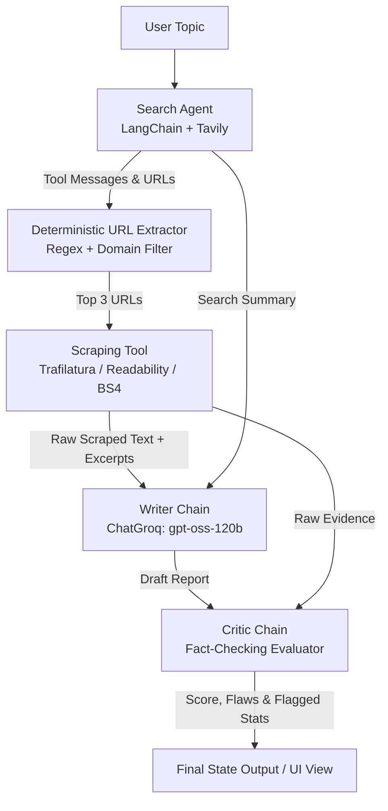

# Multi-Agent Research Assistant

An automated research pipeline that conducts targeted web searches, scrapes full source articles, synthesizes structured reports, and audits factual claims with an LLM-based critic.

[](https://www.python.org/)
[](https://www.langchain.com/)
[](https://streamlit.io/)
[](LICENSE)

## Demo

<!-- Visual preview placeholders. Record the Streamlit UI executing a query and export to assets/ -->

<!-- Capture: The Streamlit interface showing completed research, sources panel, and critic score card. -->


<!-- Capture: End-to-end execution of a topic query showing the step progress indicators and streamed results. -->

## What It Does

- Discovers authoritative web sources for a research topic using Tavily Search via a LangChain tool-calling agent.
- Extracts full-text content from up to 3 candidate URLs using a cascading extraction fallback (Trafilatura -> Readability-lxml -> BeautifulSoup4).
- Synthesizes a structured report (Introduction, Key Findings, Conclusion, Sources) strictly grounded in scraped page text.
- Cross-references the generated report against raw scraped context using a dedicated Critic agent that flags ungrounded statistics and outputs a score out of 10.
- Provides both a Streamlit web interface with live pipeline step tracking and a script-based CLI execution path.

## Architecture



### Design Decisions

- **Deterministic URL Extraction**: URLs are parsed directly from search tool messages using regular expressions rather than asking an LLM to extract them, preventing hallucinated or malformed URLs.
- **Direct Scraping Invocation**: The pipeline invokes `scrape_url` deterministically over extracted links instead of relying on autonomous agent tool-calling loops for page retrieval, reducing token overhead and latency.
- **Dual-Context Grounding**: The Writer chain receives both the search summary and up to 5,000 characters of scraped page text with strict system prompts forbidding external knowledge insertion.
- **Independent Critic Verification**: The Critic chain is isolated from the Writer and receives both the raw scraped evidence and the drafted report to score factual consistency and explicitly catch unsupported numbers.

## Tech Stack

| Component | Technology | Rationale |
| :--- | :--- | :--- |
| **Orchestration** | LangChain (`create_agent`, LCEL Chains) | Standardized tool-calling agent abstraction and composable prompt pipelines |
| **LLM Provider** | Groq (`openai/gpt-oss-120b`) | High-throughput low-latency inference with zero temperature for factual consistency |
| **Search Engine** | Tavily Search API | Search results tailored for LLM context retrieval and content parsing |
| **Extraction** | Trafilatura, Readability-lxml, BS4 | 3-stage cascading fallback to maximize clean text extraction across varied DOMs |
| **User Interface** | Streamlit | Fast reactive interface with live step tracking, raw source inspector, and export |
| **Package Manager** | uv | Fast, deterministic dependency management and virtual environment execution |

## Getting Started

### Prerequisites

- Python `>= 3.14`
- [uv](https://docs.astral.sh/uv/) package manager installed

### Installation

1. Clone the repository and navigate to the project root:
   ```bash
   git clone https://github.com/your-username/multi-agent-agentic-application.git
   cd multi-agent-agentic-application
   ```

2. Install dependencies using `uv`:
   ```bash
   uv sync
   ```

3. Create your `.env` configuration file from `.env.example`:
   - **macOS / Linux**:
     ```bash
     cp .env.example .env
     ```
   - **Windows (PowerShell)**:
     ```powershell
     Copy-Item .env.example .env
     ```

4. Populate the required API keys in `.env`:
   - `GROQ_API_KEY`: Obtain from [Groq Console](https://console.groq.com/keys) (Free tier available).
   - `TAVILY_API_KEY`: Obtain from [Tavily](https://tavily.com/) (Free tier includes 1,000 monthly searches).

### Running the Application

- **Streamlit Web UI**:
  ```bash
  uv run streamlit run src/multi_agent_agentic_application/ui/app.py
  ```

- **CLI / Direct Execution**:
  ```bash
  uv run python src/multi_agent_agentic_application/main.py
  ```

## Project Structure

```
├── .env.example               # Template for required environment variables (Groq, Tavily)
├── .python-version            # Pinned Python version (3.14)
├── pyproject.toml             # Project metadata, dependencies, and entrypoints
├── uv.lock                    # Locked dependency tree for reproducible builds
├── src/
│   └── multi_agent_agentic_application/
│       ├── __init__.py        # Package root and default CLI stub
│       ├── main.py            # CLI entrypoint demonstrating pipeline execution
│       ├── agent/
│       │   ├── __init__.py    # Agent module exports
│       │   └── agent.py       # Search agent, Writer chain, and Critic chain definitions
│       ├── pipeline/
│       │   ├── __init__.py    # Pipeline module exports
│       │   └── pipeline.py    # Multi-agent streaming orchestrator & rate-limit retry logic
│       ├── tool/
│       │   ├── __init__.py    # Tool definitions
│       │   ├── scrap_url.py   # Cascading page scraper (Trafilatura -> Readability -> BS4)
│       │   └── web_search.py  # Tavily search tool wrapper
│       └── ui/
│           ├── __init__.py    # UI module exports
│           ├── app.py         # Streamlit application with step tracking & export
│           └── styles.css     # UI styling overrides for dark/light themes
```

## Example Output

*Sample run for topic: "Impact of AI on the Job Market"*

```markdown
### Key Findings (Excerpt)
1. **Productivity vs. Displacement**: Automation accelerates routine analytical and administrative tasks while increasing demand for supervisory AI workflows.
2. **Skill Polarization**: High-cognitive roles transition towards validation and orchestration, while lower-complexity data processing roles experience net consolidation.
3. **Emergence of Hybrid Roles**: Organizations prioritize candidates with domain-specific expertise combined with AI workflow literacy over pure software coding backgrounds.

### Sources
- https://example.org/reports/ai-workforce-analysis-2025
- https://example.org/studies/labor-market-transformations
```

```text
Score: 9/10

Strengths:
- Accurately references scraped trends without inserting speculative workforce data.
- Sources match the scraped domains provided in the extraction context.

Areas to Improve:
- Could expand on industry-specific breakdowns if additional sources are scraped.

Flagged / Unsupported Statistics:
- None

One line verdict:
Factual, well-grounded summary adhering strictly to source evidence.
```

## Limitations and Known Issues

- **Rate Limits on Groq Free Tier**: Rapid consecutive requests can encounter `RateLimitError`. The pipeline implements exponential backoff and retry-after header inspection via `invoke_with_retry`.
- **Dynamic JavaScript / Paywalled Pages**: The scraper uses HTTP GET requests; client-side rendered JavaScript pages (SPAs) or paywalled articles will fail extraction and are flagged in the source list.
- **Context Window Truncation**: Inputs are capped (Search summary to 3,000 chars, Scraped text to 5,000 chars, Critic input to 4,000 chars) to prevent context overflows and control per-run token costs.
- **Hallucination Surface**: LLMs can still occasionally extrapolate beyond provided text; the pipeline mitigates this through prompt constraints and an independent critic audit pass.

## Roadmap

- Add asynchronous / parallel URL scraping to decrease total pipeline execution time.
- Integrate headless browser rendering (e.g., Playwright) for JavaScript-heavy and SPA web pages.
- Add support for local LLM fallbacks (e.g., Ollama / llama.cpp) when external API limits are exceeded.
- Implement an automated iterative loop where Writer revises reports if the Critic score falls below a set threshold.

## Author

- **Abdullah** — [GitHub](https://github.com/your-username) · [LinkedIn](https://linkedin.com/in/your-profile)
- *Note: This repository is a portfolio project demonstrating multi-agent workflows, tool integration, and fact-checking pipelines.*
